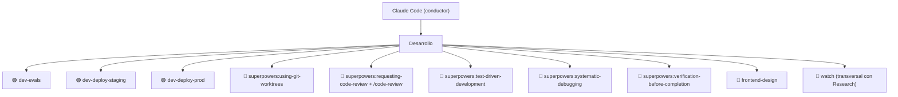

# Agentic OS — Skills rama Desarrollo — Implementation Plan

> **For agentic workers:** REQUIRED SUB-SKILL: Use superpowers:subagent-driven-development (recommended) or superpowers:executing-plans to implement this plan task-by-task. Steps use checkbox (`- [ ]`) syntax for tracking. Para CADA skill, usar superpowers:writing-skills como guía de autoría.

**Goal:** Construir los 3 skills custom de la rama Desarrollo (`dev-evals`, `dev-deploy-staging`, `dev-deploy-prod`) versionados en `~/dev/agentic-os` y activos en `~/.claude/skills/`, más el mapa-organigrama en el vault.

**Architecture:** Los SKILL.md se escriben dentro del repo (`skills/dev-*/`) como fuente única y se symlinkean a `~/.claude/skills/` para que Claude Code los descubra. El organigrama vive en el vault como markdown + Mermaid, distinguiendo nodos custom (🟢) de plugin (🔵). Los skills operan sobre el repo Petramora (ruta confirmada en Task 0).

**Tech Stack:** Claude Code skills (SKILL.md con frontmatter name/description), bash, git, symlinks (WSL→home Linux), Mermaid en markdown.

---

## File Structure

- `~/dev/agentic-os/skills/dev-evals/SKILL.md` — skill correr evals Petramora
- `~/dev/agentic-os/skills/dev-deploy-staging/SKILL.md` — skill push a staging
- `~/dev/agentic-os/skills/dev-deploy-prod/SKILL.md` — skill merge staging→master
- `~/dev/agentic-os/RECON.md` — notas de reconocimiento del repo Petramora (Task 0)
- `~/.claude/skills/dev-evals` → symlink al del repo (idem para los otros dos)
- `<vault>/proyectos/agentic-os.md` — organigrama de la rama Desarrollo

---

## Task 0: Reconocimiento del repo Petramora

Sin esto, los skills tendrían comandos inventados. Confirmamos rutas/comandos reales.

**Files:**
- Create: `~/dev/agentic-os/RECON.md`

- [ ] **Step 1: Localizar el repo Petramora y su worktree de evals**

Run:
```bash
find ~ /mnt/c/Users/"Luis Ojeda" -maxdepth 5 -type d -name ".git" 2>/dev/null | grep -i petramora
git -C <repo-petramora> worktree list
```
Expected: ruta del repo principal + lista de worktrees (incluido `feature/agent-evals`).

- [ ] **Step 2: Confirmar el comando de evals**

Run (en el worktree de evals):
```bash
cat <worktree>/pytest.ini <worktree>/evals/README* 2>/dev/null
ls <worktree>/evals/
```
Expected: ver el comando real (p.ej. `pytest evals/ -v` o `python -m evals.run`). Anotar el exacto.

- [ ] **Step 3: Confirmar ramas y remoto de deploy**

Run:
```bash
git -C <repo-petramora> branch -a
git -C <repo-petramora> remote -v
```
Expected: confirmar que existe rama `staging` y `master`, y a qué remoto apunta (para el push).

- [ ] **Step 4: Escribir RECON.md con los hallazgos**

Volcar en `~/dev/agentic-os/RECON.md`: ruta repo, ruta worktree evals, comando evals exacto, nombres de rama staging/master, remoto. Sin placeholders — valores reales.

- [ ] **Step 5: Commit**

```bash
cd ~/dev/agentic-os && git add RECON.md && git commit -m "docs: reconocimiento repo Petramora para skills dev"
```

---

## Task 1: Skill `dev-evals`

**Files:**
- Create: `~/dev/agentic-os/skills/dev-evals/SKILL.md`
- Symlink: `~/.claude/skills/dev-evals`

- [ ] **Step 1: Escribir el SKILL.md** (guíate por superpowers:writing-skills)

Usar los valores reales de RECON.md donde aparezca `<...>`:

```markdown
---
name: dev-evals
description: Use when Eric wants to run the Petramora agent evals — locates the agent-evals worktree, runs the pytest eval harness, and reports pass/fail with the report path.
---

# dev-evals — correr evals del agente Petramora

## Cuándo
Cuando Eric dice "corre los evals", "evalúa el agente", o similar.

## Pasos
1. Ir al worktree de evals: `<ruta-worktree-evals>` (de RECON.md). Si no existe,
   avisar y parar.
2. Ejecutar el arnés: `<comando-evals-exacto>` (de RECON.md).
3. Resumir: nº de casos, pass/fail, y los fallos con su mensaje.
4. Enlazar la ruta del reporte si el arnés genera uno.

## Reglas
- NO modificar código del agente para "arreglar" un eval sin que Eric lo pida.
- Si faltan deps (PEP 668), reportarlo, no romper el entorno.
```

- [ ] **Step 2: Symlink al directorio de skills de Claude Code**

```bash
ln -sfn ~/dev/agentic-os/skills/dev-evals ~/.claude/skills/dev-evals
ls -ld ~/.claude/skills/dev-evals
```
Expected: symlink apuntando al repo.

- [ ] **Step 3: Verificar que el skill se descubre**

Run:
```bash
test -f ~/.claude/skills/dev-evals/SKILL.md && head -3 ~/.claude/skills/dev-evals/SKILL.md
```
Expected: imprime el frontmatter `name: dev-evals`. (Verificación de descubrimiento real: invocarlo en una sesión nueva — checkpoint manual de Eric.)

- [ ] **Step 4: Commit**

```bash
cd ~/dev/agentic-os && git add skills/dev-evals && git commit -m "feat: skill dev-evals (correr evals Petramora)"
```

---

## Task 2: Skill `dev-deploy-staging`

**Files:**
- Create: `~/dev/agentic-os/skills/dev-deploy-staging/SKILL.md`
- Symlink: `~/.claude/skills/dev-deploy-staging`

- [ ] **Step 1: Escribir el SKILL.md**

```markdown
---
name: dev-deploy-staging
description: Use when Eric wants to deploy Petramora/BIwise to staging — commits and pushes the current work to the staging branch, which auto-deploys the staging environment.
---

# dev-deploy-staging — publicar a staging

## Cuándo
Cuando Eric dice "deploy a staging", "sube a staging", "publica staging".

## Pasos
1. Verificar estado git: `git -C <repo> status` y rama actual.
2. Si no estás en `staging`, confirmar con Eric antes de cambiar/mergear a `staging`.
3. Commit de los cambios (pedir mensaje o proponer uno claro).
4. `git push` a `staging` en el remoto `<remoto>` (de RECON.md).
5. Recordar: Vercel autodeploya con el push; el deploy de staging se dispara solo.

## Reglas duras (memoria de Eric)
- gcloud, si hace falta, se ejecuta desde **PowerShell**, NO desde WSL.
- Esto es SOLO staging — nunca tocar `master` aquí (eso es dev-deploy-prod).
```

- [ ] **Step 2: Symlink**

```bash
ln -sfn ~/dev/agentic-os/skills/dev-deploy-staging ~/.claude/skills/dev-deploy-staging
```

- [ ] **Step 3: Verificar descubrimiento**

```bash
test -f ~/.claude/skills/dev-deploy-staging/SKILL.md && head -3 ~/.claude/skills/dev-deploy-staging/SKILL.md
```
Expected: frontmatter `name: dev-deploy-staging`.

- [ ] **Step 4: Commit**

```bash
cd ~/dev/agentic-os && git add skills/dev-deploy-staging && git commit -m "feat: skill dev-deploy-staging (push a staging)"
```

---

## Task 3: Skill `dev-deploy-prod`

**Files:**
- Create: `~/dev/agentic-os/skills/dev-deploy-prod/SKILL.md`
- Symlink: `~/.claude/skills/dev-deploy-prod`

- [ ] **Step 1: Escribir el SKILL.md**

```markdown
---
name: dev-deploy-prod
description: Use when Eric wants to promote Petramora/BIwise to production — verifies staging+preview are validated, then merges staging into master (which auto-deploys prod). Guardrail skill.
---

# dev-deploy-prod — promover a prod

## Cuándo
Cuando Eric dice "deploy a prod", "promociona a producción", "merge a master".

## Guardarraíl — verificar ANTES de mergear
1. Confirmar que el deploy de **staging** se hizo y está validado.
2. Confirmar que existe **preview** validado.
3. Si CUALQUIERA falta → PARAR y avisar a Eric. No mergear sin autorización explícita.

## Pasos (solo si el guardarraíl pasa)
1. `git -C <repo> checkout master && git pull`
2. `git merge staging`
3. `git push` a `master` en `<remoto>` → Vercel autodeploya prod.

## Reglas duras (memoria de Eric)
- NUNCA merge a `master` sin staging + preview previos, salvo que Eric lo autorice.
- gcloud, si hace falta, desde **PowerShell**, NO WSL.
```

- [ ] **Step 2: Symlink**

```bash
ln -sfn ~/dev/agentic-os/skills/dev-deploy-prod ~/.claude/skills/dev-deploy-prod
```

- [ ] **Step 3: Verificar descubrimiento**

```bash
test -f ~/.claude/skills/dev-deploy-prod/SKILL.md && head -3 ~/.claude/skills/dev-deploy-prod/SKILL.md
```
Expected: frontmatter `name: dev-deploy-prod`.

- [ ] **Step 4: Commit**

```bash
cd ~/dev/agentic-os && git add skills/dev-deploy-prod && git commit -m "feat: skill dev-deploy-prod (merge staging->master, guardarrail)"
```

---

## Task 4: Organigrama en el vault

**Files:**
- Create: `<vault>/proyectos/agentic-os.md` (vault = `/home/eric_likeik/wiki`, symlink al Autoresearch)

- [ ] **Step 1: Escribir el mapa**

```markdown
# Agentic OS — Organigrama

Mapa de skills sobre Claude Code. 🟢 = custom (nuestro) · 🔵 = plugin (referenciado).

## Rama: Desarrollo (Petramora/BIwise)

Ciclo: worktree → integrar a staging → dev-deploy-staging → dev-deploy-prod



### Qué hace cada nodo custom
- **🟢 dev-evals** — corre el arnés pytest de evals del agente Petramora; reporta pass/fail.
- **🟢 dev-deploy-staging** — commit + push a `staging` (autodeploy staging).
- **🟢 dev-deploy-prod** — merge `staging`→`master` con guardarraíl (autodeploy prod).

## Ramas pendientes (réplicas del mismo patrón)
- Research (`research-*`), Comercial (`com-*`), Contenido (`content-*`).
```

- [ ] **Step 2: Verificar que el archivo está en el vault**

```bash
test -f /home/eric_likeik/wiki/proyectos/agentic-os.md && echo OK
```
Expected: OK (crear `proyectos/` si no existe).

- [ ] **Step 3: Commit en el vault** (el vault es su propio repo)

```bash
cd /home/eric_likeik/wiki && git add proyectos/agentic-os.md && git commit -m "docs: organigrama Agentic OS (rama Desarrollo)"
```

---

## Self-Review (hecho al escribir el plan)

- **Cobertura del spec:** los 3 skills custom → Tasks 1-3; el mapa → Task 4; convención de nombres `dev-*` y tipos de nodo → Task 4; reglas de deploy (PowerShell, no master sin staging+preview) → Tasks 2-3; base de evals → Task 0+1. Plugins referenciados → Task 4 (mapa). ✅
- **Placeholders:** los `<...>` son valores que Task 0 resuelve explícitamente y se sustituyen al escribir cada skill; no son TODOs sueltos. ✅
- **Consistencia de nombres:** `dev-evals`, `dev-deploy-staging`, `dev-deploy-prod` idénticos en spec, skills, symlinks y mapa. ✅
- **Nota de verificación:** el descubrimiento real de un skill se confirma invocándolo en sesión nueva — es un checkpoint manual de Eric, marcado en cada task.
